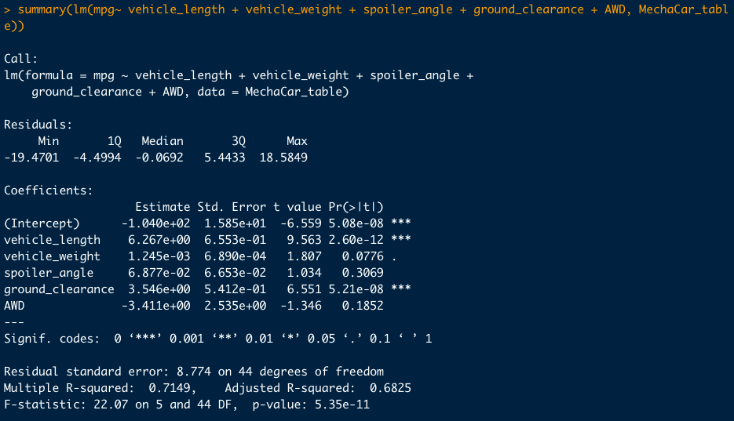
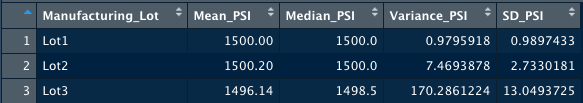
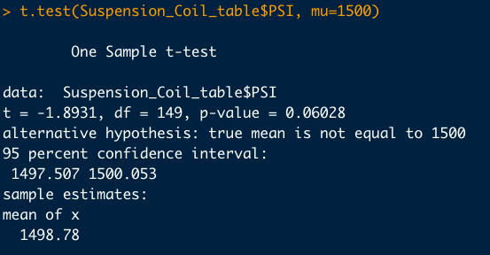
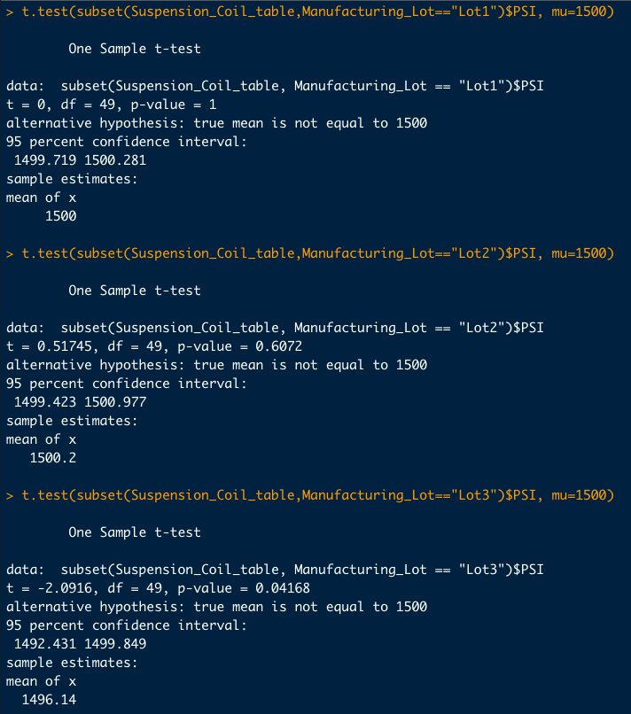

# MechaCar Statistical Analysis

## Project Overview 
AutosRU's company plans to update their decision-making process after realizing that to be competitive they need to make data-driven decisions. One of their employees will oversee the data analytics team to ensure that their new analyses include quantitative metrics, statistical tests, and visualization to make their new automobile launches a success.

AutosRU’s is facing a production problem that is delaying the manufacturing progress; their new car prototype, the **MechaCar**, is having some issues. The new analytics team will review production data to get some insights so that the production team can make informed decisions. 

### Objectives

- Perform multiple linear regression analysis to identify which variables in the dataset predict the mpg of MechaCar prototypes
- Collect summary statistics on the pounds per square inch (PSI) of the suspension coils from the manufacturing lots
- Run t-tests to determine if the manufacturing lots are statistically different from the mean population
- Design a statistical study to compare vehicle performance of the MechaCar vehicles against vehicles from other manufacturers 

### Resources
- Data Source: MechaCar_mpg.csv, Suspension_Coil.csv
- Software: RStudio and R version 4.2.2
- Bibliography: R for Everyone: Advanced Analytics and Graphics, 2nd Edition


## Results

I worked with two different datasets one containing miles-per-gallon(mpg) test results for 50 prototype MechaCars while the other showed results from multiple production lots establishing the design specifications for the MechaCar suspension coils.  These prototypes were manufactured according to certain specifications to determine the best vehicle performance. The first dataset contains different metrics collected from each prototype such as vehicle length, weight, spoiler angle, drivetrain, and ground clearance.

## Linear Regression to Predict MPG

Using the built-in ```lm()``` function in R, I created a linear regression to determine which coefficients provided a non-random amount of variance to the mpg values in the dataset. 

This is the code used to obtain the multiple linear regression.

``` mpg_regression <- lm(mpg~ vehicle_length + vehicle_weight + spoiler_angle + ground_clearance + AWD, MechaCar_table)```

**Linear Regression Model**



- After performing a **multiple linear regression**, we can see that **vehicle_length** and **ground_clearance** coefficients provide a *non-random amount of variance* to the **mpg** values.  When observing a change in the independent variable such as *vehicle length* we also observe a change in the *mpg* dependent variable. What this means is that these two variables have a considerable impact on the miles-per-gallon in each vehicle prototype.

- One important question to answer when performing multiple linear regressions is to establish if the slope does not equal zero. In this case, we can confirm that the slope of this linear model shows a non-zero correlation. Some variables' p-values show that there is a correlation because they are under the usual significance level of 0.05; for instance, the p-value for *vehicle_length* is ``` 2.60e-12 ```, and the p-value for *ground_clearance*  is ```5.21e-08```. This suggests that there is a non-zero correlation between mpg and both variables. 

- Another important thing to observe in this linear model is to determine if it effectively predicts the mpg of the MechaCar prototypes. It seems that this multiple linear regression model predicts well the mpg of the MechaCar Prototype. By observing the multiple r-squared of the model of 0.7149, we can assert that around 70% of the variability of our dependent variable is explained with this model. 


## Summary Statistics on Suspension Coils

The design specifications for the MechaCar suspension coils dictate that the variance of the suspension coils must not exceed 100 pounds per square inch(PSI). The dataset shows test results of the weight capacities of multiple suspension coils in all production lots. To determine if the current manufacturing data meets these specificities, I will establish the mean, median, variance, and standard deviation. 

The following code was used to find the mean, median, variance and standard deviation. 

```total_summary_suspension <- Suspension_Coil_table %>% summarize(Mean_PSI= mean(PSI), Median_PSI= median(PSI), Variance_PSI= var(PSI),  SD_PSI= sd(PSI),  .groups = 'keep')```

**Total Summary Suspension**


When looking at the total summary suspension table above, we can see that the MechaCar design specifications are being met. The variance of the suspension coils in the total summary is ~62.3 which is less than 100 PSI.
However, when we observe the summary per lot, in the table below, we find that lot number 3 is exceeding the design specifications. In lot number 3 we see a variance of ~170.3 PSI surpassing the 100 PSI. 

**Lot summary PSI**




## T-Tests on Suspension Coils

AutosRU’s asked for further analysis, therefore I also performed a T-test on the Suspension Coils data to determine if all the manufacturing lots and each individual lot were statistically different from the population mean of 1500 PSI. 

This is the code I use to perform the T-test.

```PSI_t.test <- t.test(Suspension_Coil_table$PSI, mu=1500)```

**T-tests for all lots**




The t-test for all the manufacturing lots shows that there is not a significant statistical difference between the mean of all lots and the presumed population mean. The population mean of 1500 PSI falls within the confidence interval of 1497.507 and 1500.053. The p-value also indicates that we fail to reject the null hypothesis and accept that the mean is equal to ~1500 PSI.


The following code was used to determine the t-test for all lots.
``` t.test(subset(Suspension_Coil_table,Manufacturing_Lot=="Lot1")$PSI, mu=1500)```
```t.test(subset(Suspension_Coil_table,Manufacturing_Lot=="Lot2")$PSI, mu=1500)```
```t.test(subset(Suspension_Coil_table,Manufacturing_Lot=="Lot3")$PSI, mu=1500) ```


**T-tests for subsets**


When performing the t-test for each individual lot, we find that the mean of lot number 1 and lot number 2 both fall within their respective confidence intervals failing to reject the null hypothesis. We can observe that there is no statistical difference between the sample mean and the population mean.

However, the t-test for lot number 3 shows that there is a significant statistical difference between the mean of the sample distribution and the mean of the population distribution. The population mean of 1500 PSI falls outside our confidence interval of 1492.431 and 1499.849. The t-test p-value of 0.04168 is less than the usual significance level of 0.05, which indicates that we can reject the null hypothesis and support our alternative hypothesis that the true mean is not equal to 1500 PSI. 

## Study Design: MechaCar vs Competition

To further our analysis and see how the MechaCar prototype performance compares to other competitors, we could make a comparison of one or several variables of interest against the same variables in vehicles from other manufacturers.

For instance, one variable of interest yielded from our regression analysis is vehicle length. We could compare vehicle length against the vehicle length from other manufacturers and observe if it affects their fuel efficiency, in this case, our mpg data. However, we first need to compare the MechaCar vehicle length *mean* against the vehicle length *mean* from other manufacturers. 

Our research question would be the following:

-	**Is there a statistical difference in the vehicle length across different manufacturers?**

Our null hypothesis or H0 is:

**H<sub>0</sub>: The *Mean* vehicle length  of all groups are equal.**

Our alternative hypothesis or Ha is:

**H<sub>a</sub>: At least one *Mean* of the vehicle length is different from all other groups.**

To answer this question, we would need to obtain vehicle length data from other manufacturers to compare it against our data using a **one-way ANOVA** test, which is used to test one independent variable with variables in multiple groups.

Using R, and R studio we would need to have all the data in one clean data frame and use the ```aov()``` function and add a ```summary()``` function to observe which group is different from the rest. To analyze the yielded results, we would observe the *p-value* and *confidence intervals* for all groups and determine if there is a significant statistical difference in order to reject our null hypothesis or fail to reject it. 
